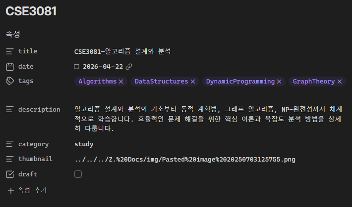

# Concepts

**Context Engineering**

[Context Engineering: AI 시대의 새로운 핵심 역량](https://devocean.sk.com/blog/techBoardDetail.do?id=167772)

Context Engineering은 대형 언어 모델(LLM)의 성능을 극대화하기 위해 정보 환경을 체계적으로 설계하는 새로운 핵심역량으로, 단순히 프롬프트를 최적화하는 Prompt Engineering을 넘어선다.
단순한 프롬프트 최적화를 넘어서 LLM의 전체 정보 환경을 체계적으로 설계하는 공식적인 학문 분야로 발전한 것이다.

Context Engineering은 다음 세 가지 주요 영역으로 구성된다.
1. Context Retrieval and Generation: 프롬프트 기반 생성, 외부 지식 습득, 동적 정보 검색
2. Context Processing: 긴 시퀸스 처리, 자체 개선, 구조화된 정보 통합
3. Context Management: 메모리 계층구조, 압축 최적화, 확장성 있는 관리

Context Window: LLM이 한 번에 처리할 수 있는 토큰의 최대 길이
```
Context Window = System Prompt + Conversation History + Retrieved Documents + Current Input + Reserved for Output
```

일정 관리 사례를 예시로 Prompt Engineering과 Context Engineering을 비교하자면 아래와 같다.
- Prompt Engineering 접근: "내일 회의 일정 잡아줘" → 기본적이고 로봇적인 응답
- Context Engineering 접근: 캘린더 정보, 과거 이메일, 연락처 정보, 도구 접근권한을 모두 통합 → "Jim! 내일은 하루종일 빽빽해. 목요일 오전이 괜찮다면? 초대장 보냈어, 확인해봐."

# 2026.04.07 | Cursor Setting

코테 준비 하다가 하기 싫어서 또 토이 프젝으로 도망 왔다.
본격적인 사이트 개선에 앞서 바이브 코딩 준비를 해보고자 한다.

오늘 달성하고자 하는 건 앞의 두 가지다. 나머지는 천천히 진행해보고자 한다.
1. Cursor Setting
2. `post.json` 및 `/posts` 페이지 생성
3. `/posts/[slug]`
4. TagFilter Component
5. Supabase Connection

우선 Cursor를 다운 받았다.
Cursor는 따지자면.. 프로젝트 코드 전체 파일을 지속적으로 반영하여 개발을 보조하는,
말하자면 GPT + VSCode 같은 느낌이다.

Cursor에 프로젝트별 커스텀 프롬프트 세팅을 만들어보자.
자세한 사항은 [규칙 | Cursor Docs](https://cursor.com/ko/help/customization/rules) 참조.

내가 수립한 규칙은 다음과 같다.
1. 기존 아키텍처 보호
2. 내가 만든 Markdown Renderer만 쓰도록 하기
3. RSC-first 강제: Server Component 우선 사용
4. 과한 추상화 금지: 쓸데없는 util, wrapper 만들지 않기
Cursor가 시니어 개발자처럼 행동하게 하는 것이 포인트다.

이제 개발을 시작해보자. 


| Command     | Key        |
| ----------- | ---------- |
| 터미널 열기      | `Ctrl + J` |
| Composer 모드 | `Ctrl + I` |

# 2026.04.22 | Post Page & Tagging

## Overview

우선 포스팅 페이지를 구축했다.
기존에 첫화면에서 사용해서 public에 두었던 `.md` 컨텐츠들은 따로 `content/*.md`로 옮겼고, 그에 따라 코드도 전폭 수정했다.


1. Front Page에서 Archive Section을 없앴고,
2. 상단에 Post 페이지 바로가기 버튼을 따로 만들었다.
3. Post Page는 현재 `.md` 파일의 제목만을 읽어와 Renderer를 통해 렌더링 되는 링크 버튼이 나열되어있다.

이 당시에 포스팅의 기반이 되는 Obsidian으로 작성한 Markdown에는 아직 Front Matter가 존재하지 않았다. 내가 옵시디언을 Raw하게 쓰고 있기도 했고 Template라는 것도 이번 개발을 진행하면서 처음알았다.

## Development

**Front Matter**
| 마크다운 문서나 정적 사이트 파일의 최상단에 `---`로 구분된 영역에 작성하는 Metadata 블록이다.

주로 YAML 형식을 사용하고 콘텐츠 본문 전의 설정 정보를 정의한다.
주요 활용처는 다음과 같다:
- 정적 사이트 생성기: Hugo, Hexo, Jekyll 등
- 지식 관리 도구: Obsidian
- AI 프롬프트: CLAUDE.md, SKILL.md 등 구조화된 문서 처리

이런 식으로 작성한다.
```yaml
---
title: "포스트 제목"
date: 2024-04-20
tags: ["blog", "markdown"]
categories: ["Tech"]
---
```

아까도 언급했지만 나는 옵시디언에 저런게 있는지조차 몰랐다`..`
그래서 처음엔 생 마크다운 텍스트를 가지고 Front Matter를 생성하는 빌드 스크립트를 작성하고자 하였다.

다음과 같은 개념들이 필요했다.
- Markdown parsing
- Static site indexing
- NLP (embedding)
- Information retrieval (cosine similarity)
- Build pipeline
- Caching system

다음과 같은 파이프라인 구조를 띄고 있다.
```text
.md 파일들
   ↓
(front matter + 본문 분석)
   ↓
자동 태깅 + 요약 + slug 생성
   ↓
posts.json 생성
```

gray-matter를 사용해서 markdown 문서를
- Front Matter `data`와
- 본문 `content`으로 나눈 뒤,

태그 시스템을 기반으로 사이트 내 포스트 검색을 최적화하고자 하였다.

#### Existing Tags

Obsidian에서부터 날라온 태그들이다.
그냥 둔다.

#### Rule-based Tagging

content의 내용을 분석해서 내가 정의한 keyword `tagRules` 기반으로 Rule-based Classification을 한다.
그냥 이 과정은 본문 내용을 바탕으로 문자열 일치 여부만 채크해서 해당 keyword를 가지고 있는 tag를 태그로 추가하는, 하드 코딩이다. 내가 일일이 사전을 정립해야한다는 단점이 있다.

#### Light AI Tagging - Embedding

Embadding 기반 Taging을 하는데, `text-embadding-3-small`이라는 OpenAI API를 사용하였다.
1. 글 제목 + 본문 일부를 Embedding을 통해 벡터로 변환한다.
2. 미리 정의 해놓은, 블로그에서 사용할 태그 후보 집합 `TAG_VOCAB`도 벡터로 변환한다.
3. `consineSimilarity()`를 이용해서 코사인 유사도를 계산한다. 1에 가까울 수록 의미적으로 비슷한거고, 0은 관계없음, -1는 반대이다.
4. 1에 가까운 상위 3개의 태그를 선택한다.

후에 Existing Tags + Rule-bsaed Tags + Light AI Tags를 모두 합쳐
`tags`라는 Fonrt Matter 요소를 생성한다.

음.. 굉장히 쓸데없는 짓을 했나 싶기도 하고
경량 NLP 모델을 활용해서 의미있는 데이터를 추출했으니 좋은 경험이었나 싶기도 하다.

## Result


일단 굉장히 아마추어스러운 포스팅 화면이 완성되었다..
요약도 그냥 마크다운 본문 앞에 몇글자 자른거라 `<br>`같은 것도 가감없이 표시되는 걸 볼 수 있다.

하지만 현재 Obsidian을 이용해서 다음과 같이 AI Hybrid Tagging에 성공했기 때문에 금방 개선 가능할 것이다.


Templater 기반 AI Hybrid Front Matter 생성에 대해선 후술하겠다.

## Plan

현재
- Obsidian: 문서 작성 + Front Matter 생성
- Site: Front Matter 생성(중복, 후에 중복되는 부분 삭제) + 포스트 페이지 + 마크다운 포스트 렌더링

이니까 이 다음부터는
메크로를 이용해서 내 포트폴리오 사이트 리포지토리의 content/posts/에 연동 시 Github Markdown으로 올라가도록 자동화해볼까 한다.

그리고 그 다음엔 npm run generate-post가 실행되어 자동으로 post.json이 업데이트 되고, Post Page에 새로운 글이 생기는/또는 수정되는.. 과정을 진행해볼까 한다.

이 과정에서는 draft 태그를 이용해 draft가 true(비공개)로 되어있으면 generate-post가 실행되지 않는 등 자원을 아끼는 방향으로 최대한 인프라를 구축해보고자 한다.

# 2026.04.?? | Obsidian Templater - AI Hybrid Front Matter Generator

우선 전체적으로 gemini-flash-mini 모델을 사용해서 TOC(Table of Context) + 앞의 1000자를 바탕으로 토픽과 관련된 태그를 추출해내는 것 까지는 구현해놓았다.

# 2026.05.13 | Obsidian - Github - My-site 연동

여태까지 구축해놓은 기능들을 활용 및 반영해서 Obsidian - My site 자동 연동 포스트 시스템을 새로이 구축하고자 한다.

계획은 이렇다:
```
Obsidian Vault
    ↓
Published Content Repo
    ↓ (submodule)
Next.js Portfolio Site
    ↓
Vercel
```

그러니까 아래와 같이 되는거다.
- Obsidian = Authoring System
- Github = Contents DB
- Next.js = Renderer

문제는 지금 콘텐츠랑 사이트 코드가 강하게 결합되어있다는 점인데..

## Feat 1: Git hook `pre-push`

일단 Git 이라는 Obsidian 플러그인을 깔았다.

Obsidian Vault(파일탐색기)에서 git init을 하고, `.gitignore`를 다음과 같이 구성하였다.
- 내가 올리기로 결정한 `Published` 폴더와 `Docs` 외에 모든 폴더 제외
- `Docs` 폴더 안 민감 정보를 담고 있는 `.txt` 파일 제외

일단 기본적인 Git 구성은 끝냈으니, 다음은 Git Hook를 이용하여 자동 변환 후 업로드를 해볼 차례다.
```
Git pre-push hook
    ↓
obsidian-to-github-md.py
    ↓
obsidian-published-content repo
```

이때 주의해야할 사항은, 기존 `obsidian-to-github-md.py` 코드는 이미지 링크를 외부 URL 기반 변환이 아니라 그냥 Github 리포지토리 폴더 내에서 상대경로로 인식 가능하도록으로만 변환을 했다는 점이다.
완전히 URL로 바꾸는 것은 사이트의 `MarkdownRenderer.tsx`에서 진행했었다.
죽, 문법 변환이 github 올리기 전에 한 번, 사이트 렌더러에서 한 번 이루어지는 비효율적인 구조였다는 것이다.

이 과정을 한꺼번에 합쳐서 다음과 같이 모듈별로 기능을 분리하고자 한다.
- `obsidian-to-github-md.py`: 컴파일러
- `MarkdownRenderer.tsx`: 렌더러

GPT가 **jsDelivs CDN**이라는 것을 추천해줘서, 이걸로 한번 해볼까 한다.
그낭 raw.githubusercontent.com보다는
- 빠름
- 안정적
- Vercel 친화적
이라고 한다.

우선 이를 반영해서 사이트에 올릴 문서를 변환하는 `obsidian-to-github-md.py`의 수정을 완료하였고, github에서 무사히 렌더링 되는 것도 확인하였다.

## Feat 2: Github Actions

Git hook으로 자동 변환 워크플로우를 구축하면 `obsidian-to-github-md.py` 변환기 내부에서 subprocess로 git 커맨드를 돌리는 구조라 pre-push를 사용하면
- 두 번 push가 된다거나,
- commit 메시지를 내 맘대로 할 수 없다거나
하는 문제가 있었다.

그래서 Github Actions를 도입해서 `obsidian-to-github-md.py`는 변환기 역할만 수행하고 Git은 전혀 모르는 순수한 Compiler 역할만 담당하도록 변경했다.
즉, `Published` 폴더의 원본 문서는 전혀 수정하지 않고 변환된 결과만 임시 폴더에 생성하도록 구조를 변경하였다.

최종적으로 Github Actions를 활용하여 워크플로우를 다음과 같이 작성하였다.
```
git push
↓
GitHub Actions
↓
obsidian-to-github-md.py
↓
.temp_publish 생성
↓
Published 교체
↓
Commit
↓
Push
```

즉, 로컬 Obsidian Vault는 항상 Obsidian 문법을 유지하고, GitHub 저장소에는 GitHub Markdown으로 변환된 문서만 저장되는 구조를 구축했다.

또한 변환 과정은 GitHub Actions의 Runner 내부에서만 수행되기 때문에
임시 폴더(`.temp_publish`)는 작업 종료와 함께 자동으로 삭제된다.
따라서 저장소나 저장소에 불필요한 임시 파일이 커밋되지 않는다.

현재까지는 GitHub Actions를 통해 변환된 Markdown 문서가 정상적으로 생성되고, 원격 저장소까지 자동으로 반영되는 것을 확인하였다.

# 2026.06.15 | Resume Page 개설 및 암호화

다음과 같은 구조로 간단하게 만들어볼까 생각 중이다

```
Resume 클릭
↓
비밀번호 입력
↓
POST /api/auth
↓
성공
↓
HttpOnly Cookie 발급
↓
/resume 이동
↓
Download PDF
↓
/api/resume-pdf
↓
서버에서 PDF 생성
↓
다운로드
```

